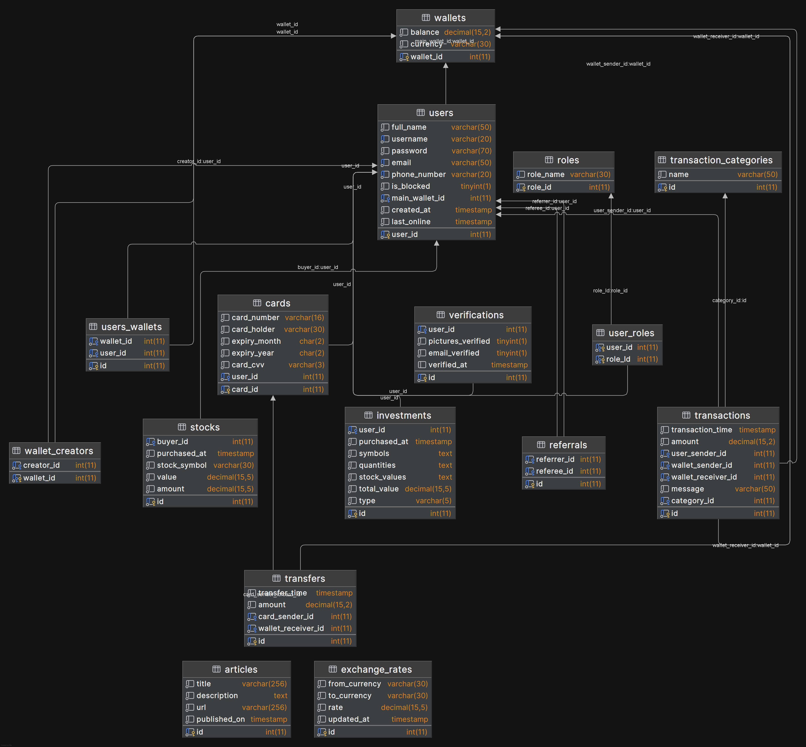

# YNPay - Virtual Wallet

## Access to Project

We have deployed our project using **AWS**. Also, we provide **Swagger API Documentation** to facilitate testing and exploration of the REST API’s endpoints.

- **App URL**: [`http://ynpay.webredirect.org/ui/home/`](http://ynpay.webredirect.org/ui/home)
- **Swagger URL**: [`http://ynpay.webredirect.org/swagger-ui/index.html`]()

## Overview

This web application provides a comprehensive financial management platform, integrating user authentication, virtual wallets, stock trading, and administrative controls. Users can securely manage their accounts, conduct financial transactions, and invest in stocks, while administrators have the ability to monitor and manage platform activity.

---

## Features

- **User Management**
    - Register and authenticate using SpringSecurity.
    - Verify the created account from the email address provided upon registration.
    - Recover forgotten password or reset current password from the current email address associated with the user's profile.
    - Manage user profile details including name, email address, phone number and profile pictures.
    - Upload verifications photos (ID photo and a selfie) in order to verify identity.
    - Delete account.
    - Referral program - current users can invite new people to register via their email adn their unique JWT token. Upon registration of the invited user both they and their referer receive 50 USD in their main wallet respectively.
    - Financial news are available via an outside API and updated regularly.
    - Functional contact form is implemented for questions regarding the application.

- **Credit/Debit Card Management**
    - Upload, save, update and delete multiple Credit/Debit card details to user's profile.
    - Make deposits to user's main virtual wallet (created by default upon registration) from a saved Credit/Debit card to virtual wallet (this uses a built-in dummy bank API which confirms/rejects debits).

- **Virtual Wallets & Transactions**
    - A default main virtual wallet is created in USD upon user registration. Users can create more wallets (up to 10 in total) in one of the available currencies (USD, EUR and GBP).
    - Joint wallets functionality - users can add or remove other users from each of the wallets created by them by username. Users added to another user's wallet can make transactions from it, see transactions involving this wallet and can see all users associated with the wallet.
    - Users can make transactions from each of their wallets either by the receiver's username or phone number or by wallet IBAN (unique identifier assigned to each wallet upon its creation).
    - Users can also make transactions between the wallets they control - exchanging currencies or transferring to a join wallet.
    - Currency exchange rates are updated daily and used for transactions between wallets of different currencies.
    - Transaction history is available for each wallet individually and overall for the user (all wallets they are currently associated with) complete with sorting and filtration.

- **Stock exchange**
    - Each user controls a portfolio of stocks, which they can trade with real time updates on stock values from their main wallet in USD only.
    - Investment history is available for each user complete with sorting and filtering.

- **Administrator Management**
    - See all current users, history of transactions and investments complete with sorting and filtering.
    - Manually verify the verification photos provided by users.
    - Block and unblock users.

- **Miscellaneous**
    - Light and dark themes are available.
    - FAQ.
    - Remember password functionality for login. 
---

## Technologies Used

- **JDK 17**
- **Spring Boot framework**
- **Hibernate**
- **Gradle**
- **MariaDB**
- **SpringSecurity**
- **JWT Authentication**
- **Swagger API Documentation**
- **TwelveData API for Stock prices and Currency Exchange Rate updates**
- **Finnhub API news updates**
- **Starter Mail for Email Verification**
- **FormSpree for contact forms**
- **AWS for database hosting**

---

## Installation

Follow these steps to set up and run the application:

1. **Clone the Repository**  
   Download the project folder:
   ```sh
   git clone https://github.com/telerik-spring-boot/Virtual-Wallet.git
   cd Virtual-Wallet
   ```

2.**Create local .env file in src/main/resources directory and configure variables**

3.**Run the Application**  
   Execute `VirtualWalletApplication.class` to start the project.

---

## **IMPORTANT NOTES**

⚠️ **Security Disclaimer**
- This is a learning project and does not involve real financial transactions or stock trading.
- Do not use actual credit card details or personal information.

---

## Database Diagram



<br>

---

## App Preview

**Home Page**


**User Dashboard**


**Admin Panel**


**Stocks Section**


**Wallets Section**


<br>

---

## Solution Structure

- **REST Controllers**: Expose API endpoints to handle user, transaction, and wallet-related operations, facilitating communication between the frontend and backend.
- **MVC Controllers**: Manage HTTP requests and responses related to user, transaction, and wallet functionalities.
- **Services**:  Contain business logic for handling user accounts, transactions, and wallet management.
- **Repositories**: Provide database interaction for performing CRUD operations using Hibernate.
- **Models**:  Define core entities such as Users, Transactions, Wallets, and Credit/Debit Cards.

---

## Contributors

For further information, please feel free to contact us:

| Authors              | GitHub                                       |
|----------------------|----------------------------------------------|
| **Yordan Tsolov**    | [GitHub Link](https://github.com/o0Danii0o)  |
| **Nikolay Pilashev** | [GitHub Link](https://github.com/nPilashev)  |

---